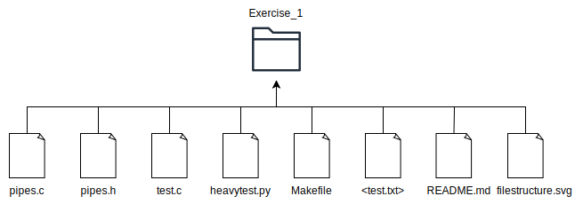

# EXERCISE 1.1: FIFO pipes

## Description

This exercise focuses on creating an independent FIFO pipes library, which the developer can then use in other C programs. In this project we created a test that is intended to test the functionality of the library. For this purpose we created two pipes and two threads that communicate via these pipes in order to exchange a file's contents to create two identical files.

## Library Functions

The library includes the following functions:

- **Pipe Open**: Opens a pipe for communication between threads or processes.
- **Pipe Read**: Reads a byte from the pipe.
- **Pipe Write**: Writes a byte to the pipe.
- **Pipe WriteDone**: Signals that writing to the pipe is complete.

## Compile and Test
The folder contains a Makefile with the following functionality:

**make** or **make all :** Shows all the targets available in the Makefile.

**make compile :** Compiles the code.

**make run f=\<filename> :** Compiles and runs the program, using the specified file as input.

**make heavytest f=\<filename> n=<number_of_iterations> :** Runs a heavy test by calling a Python script to compare the output files with the original one.

**make clean :** Removes the compiled output files (test, test.o, pipes.o), along with any .std and .error files.

**make clean.copy :** Deletes any .copy and .copy2 files created by running the program.

**make cleanall :** Combines make clean and make clean.copy to remove all generated files.

**make diff f=<filename> :** Compares the given file with its generated copies (<filename>.copy and <filename>.copy2).

## File Structure

**pipes.c:** Contains the implementation of the library functions.

**pipes.h:** Header file for the library.

**test.c:** Contains the test program as described in the first section.

**heavytest.py:** Python script to run the program multiple times and compare the .copy and .copy2 results to ensure correctness.

**Makefile:** Implements the make commands mentioned above.

**<test.txt>:** The input file(s) for the executable. The \<filename> mentioned above.

**README.md:** This is the current file that you are reading :) .

**filestructure.svg:** The photo above.
