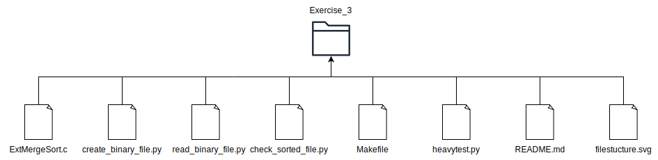

# EXERCISE 1.3: FIFO pipes

## Description

This exercise implements a parallel version of External Merge Sort. The input is a binary file. Hidden temporary files are created for subarrays bigger than 64 integers. For arrays and subarrays smaller or equal to 64 integers Internal Merge Sort is used. 

## Thread Use

For each iteration of Parallel External Merge Sort a new thread is created for each subarray. Internal Merge Sort is implemented when the subarrays get to be smaller than 64.

## Compile and Test
The folder contains a Makefile with the following functionality:

**make** or **make all :** Shows all the targets available in the Makefile.

**make compile :** Compiles the code.

**make run f=\<filename> :** Compiles and runs the program, using the specified file as input.

**make create_bin f=\<filename> s=\<size> :** Creates a binary file of given size (in integers) to be used as input for the program.

**make read_bin f=\<filename> :** Prints the binary file in terminal.

**make convert_bin_to_txt f=\<filename> :** Converts the binary file to a text file labeled \<filename>.txt .

**make check_sorted f=\<filename>** Checks and prints if the input txt file is sorted.

**make heavytest f=\<filename> s=\<array_size> :** Runs a heavy test by calling a Python script to create a binary file with given name \<s> times. First time the binary file will be 1 integer long, second time 2 integers long and goes on until the binary file is of size \<s> integers.

**make clean :** Removes the compiled output file, along with any .txt and .bin files.

**make clean.hidden :** Deletes any .hidden files left by running the program.

**make cleanall :** Combines make clean and make clean.heavy to remove all generated files.

## File Structure

**ExtMergeSort.c :** Contains the implementation of the library functions.

**create_binary_file.py :** Creates the binary file of given number of integers to be used as input for the executable.

**read_binary_file.py :** Reads a binary file of integers and prints them on the terminal.

**check_sorted_file.py :** Reads a text file of integers and prints if they are sorted or not.

**heavytest.py:** Python script to run the program multiple times and check its correctness. It creates several input files of size 1 - Target incrementing their size by 1 each time.

**Makefile:** Implements the make commands mentioned above.

**README.md:** This is the current file that you are reading :) .

**filestructure.svg:** The photo above.
